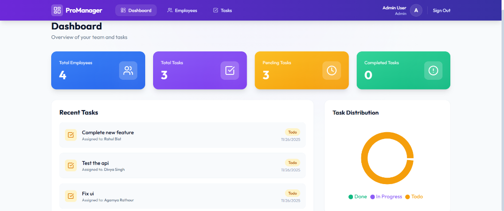
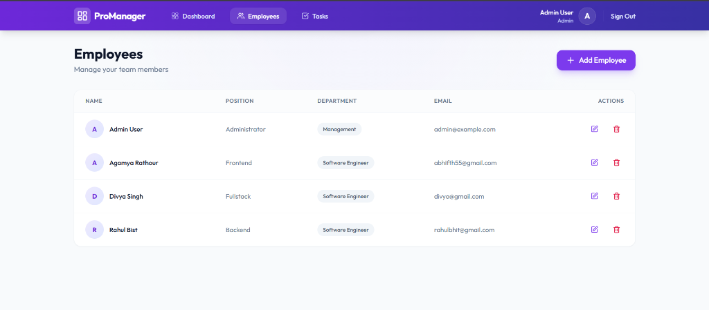
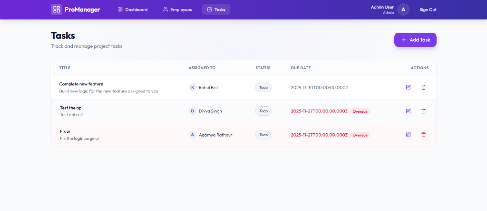
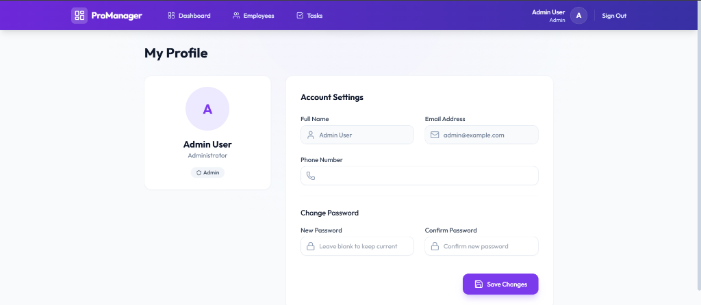

# Employee & Task Management System

A full-stack application for managing employees and tasks, built with React, Node.js, and SQLite.

## Tech Stack

- **Frontend**: React, Vite, TailwindCSS, Axios, React Router, Lucide React
- **Backend**: Node.js, Express, SQLite3, PostgreSQL
- **Database**: SQLite (Local Development) / PostgreSQL (Production - e.g., Render)

## Features

- **Dashboard**: Overview of total employees, tasks, pending tasks, and completed tasks.
- **Authentication**: Secure login page with route protection.
- **Profile Management**: View and update user profile details including password changes.
- **Employee Management**: List, Add, Edit, and Delete employees.
- **Task Management**: List, Add, Edit, and Delete tasks. Assign tasks to employees.
- **Responsive Design**: Built with TailwindCSS for a modern and responsive UI.

## Screenshots

### Login Page


### Dashboard


### Employee Management


### Task Management


### User Profile


## Setup Instructions

### Prerequisites

- Node.js installed on your machine.

### 1. Clone the Repository

```bash
git clone <repository-url>
cd <repository-folder>
```

### 2. Backend Setup

Navigate to the `server` directory and install dependencies:

```bash
cd server
npm install
```

Start the backend server:

```bash
npm start
```

The server will run on `http://localhost:5000`.
The database (`database.sqlite`) will be automatically created and seeded with initial data.

**Note for Production (e.g., Render):**
If a `DATABASE_URL` environment variable is present, the application will automatically switch to using PostgreSQL. Ensure your PostgreSQL database is provisioned and the connection string is correct.

### 3. Frontend Setup

Open a new terminal, navigate to the `client` directory and install dependencies:

```bash
cd client
npm install
```

Start the frontend development server:

```bash
npm run dev
```

The application will run on `http://localhost:5173` (or the port shown in the terminal).

## Default Login Credentials

| Role | Email | Password | Access |
|------|-------|----------|--------|
| **Admin** | `admin@example.com` | `admin123` | Full Access (Employees, All Tasks) |
| **Employee** | `bob@example.com` | `user123` | Limited Access (Assigned Tasks Only) |

## API Endpoints

- `GET /api/employees`: Get all employees
- `POST /api/employees`: Create a new employee
- `PUT /api/employees/:id`: Update an employee
- `DELETE /api/employees/:id`: Delete an employee
- `GET /api/tasks`: Get all tasks
- `POST /api/tasks`: Create a new task
- `PUT /api/tasks/:id`: Update a task
- `DELETE /api/tasks/:id`: Delete a task

## Assumptions

- The database is SQLite for simplicity and ease of setup.
- Authentication is implemented using JWT (JSON Web Tokens) for secure access.
